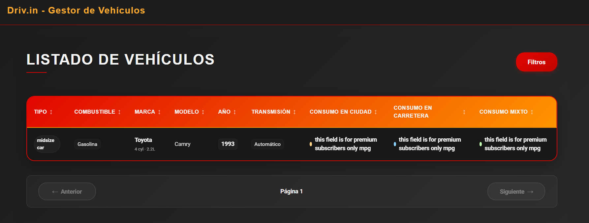

# Driv.in — Gestor de Vehículos

API de datos: https://api-ninjas.com/api/cars

Este repositorio contiene una pequeña aplicación React + Vite para explorar y filtrar un catálogo de vehículos. La app fue desarrollada pensando en poder usar la API real de API Ninjas (requiere API key) pero, por las limitaciones de la key gratuita, la aplicación usa un mock local para poder probar todas las funcionalidades.

## Cómo ejecutar el proyecto

Requisitos previos:

- Node.js (>=18 recomendado) y npm o yarn.

Pasos:

1. Instalar dependencias

```bash
npm install
# o
yarn
```

2. Ejecutar en modo desarrollo

```bash
npm run dev
# o
yarn dev
```

Luego abrir http://localhost:5173/ (Vite mostrará la URL exacta en la consola).

3. (Opcional) Build de producción

```bash
npm run build
# o
yarn build
```

4. (Opcional) Previsualizar el build

```bash
npm run preview
# o
yarn preview
```

## Uso de la API real vs mock

La API de datos objetivo es: https://api-ninjas.com/api/cars

Decisión tomada: la app usa un mock (`src/mocks/vehiclesMock.ts`) por defecto para evitar depender de la cuota limitada de la API gratuita y para permitir probar filtros y paginación sin restricciones. El mock reproduce la forma de los datos esperados por la UI y permite todas las funcionalidades.

Si tenés acceso a una API key de API Ninjas y querés usar la API real:

1. Crea un archivo `.env` en la raíz del proyecto con las variables:

```
VITE_API_URL=https://api.api-ninjas.com/v1
VITE_API_KEY=TU_API_KEY_AQUI
```

2. En `src/services/api.ts` hay llamadas reales comentadas. Descomentá la sección marcada con "Implementación real" y comentá o sacá el uso del mock para que las llamadas vayan al servidor real.

3. Reiniciá el servidor de desarrollo.

Nota: En `src/config/axios.ts` se configura axios para enviar la cabecera `X-Api-Key` con `import.meta.env.VITE_API_KEY`.

Captura que muestra la app cuando se usa la API sin permisos premium:



## Decisiones técnicas

- Vite + React + TypeScript: elección por rapidez en desarrollo y hot-reload.
- React Query (`@tanstack/react-query`) para manejo de caché y fetching (aunque con mock local la experiencia sigue siendo la misma que con la API real).
- Leaflet + react-leaflet para el mapa de ubicaciones de vehículos.
- Axios para llamadas HTTP; la instancia está en `src/config/axios.ts` y toma `VITE_API_URL` y `VITE_API_KEY` desde variables de entorno.
- Mock local en `src/mocks/vehiclesMock.ts` para pruebas determinísticas y offline.
- Tests: hay una prueba de componente (`src/components/VehicleTable/VehicleTable.test.tsx`) usando Jest + Testing Library.

# Sobre el id de cada vehículo

La API (y el mock) no traen un identificador único por registro. Para construir rutas reproducibles y amigables se genera un id en la tabla así (incluye transmisión):

```ts
encodeURIComponent(`${make}-${model}-${year}-${transmission}`);
```

(Implementación: `src/components/VehicleTable/VehicleTable.tsx`, función `handleRowClick`).

### Por qué:

- **Simple**: combina campos que distinguen una variante del vehículo (marca, modelo, año y transmisión).
- **URL-safe**: `encodeURIComponent` evita caracteres inválidos en la ruta.
- **Determinista**: siempre genera el mismo id para la misma combinación, lo que facilita reproducibilidad (ejemplo: `getVehicleLocation`).

### Unicidad:

- En la práctica, esta combinación suele ser **suficientemente única** dentro de los datos mock o respuestas de la API.
- **No garantiza unicidad absoluta**: pueden existir colisiones si la API devuelve dos registros con la misma marca, modelo, año y transmisión (por ejemplo, variantes con distinto `trim`, motorización o tracción).

### Cómo se consume:

- `MapView` decodifica con `decodeURIComponent`, separa por `-` y extrae `make`, `model`, `year` y `transmission` para recuperar el vehículo con `getCarById` (`src/views/MapView/MapView.tsx`).

### Limitaciones:

- Aunque es determinista y legible, **no es un id de base de datos**.
- Para un entorno de producción lo ideal es usar un id único provisto por el backend.
